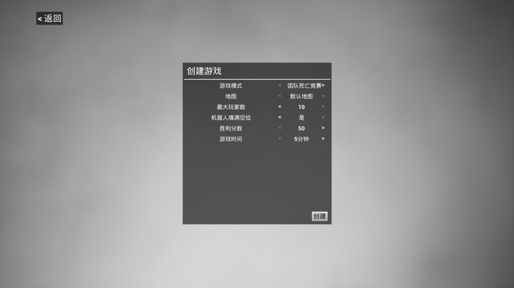
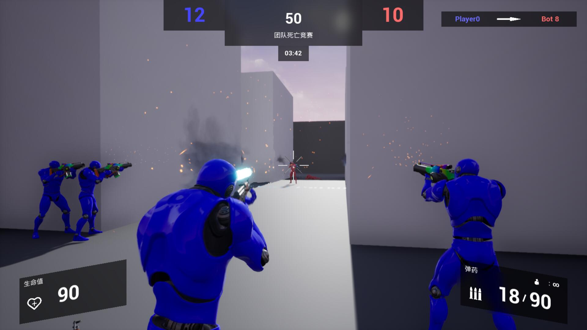
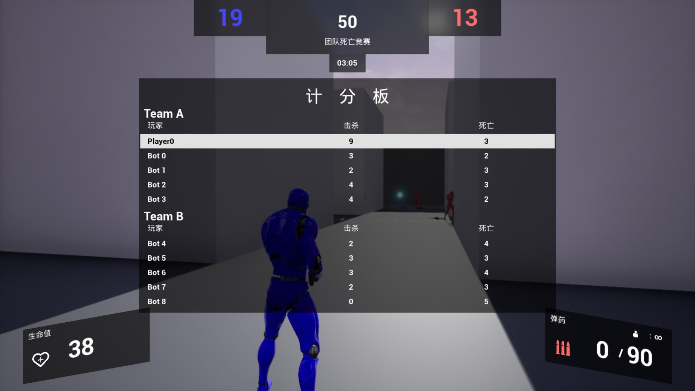

# UE4_MultyPlayerShootingGame

项目文件及可执行程序见Release

项目文件 - Final Assginment.zip

可执行程序 - UE4_MultyPlayerShootingGame.zip

已知但来不及改的Bug：

- 客户端tab计分板的更新有时会延迟

- 团队竞技模式中，极少数情况下会出现bot死亡但队伍存活数没有减少，导致回合无法结束的bug

未知bug：

- 应该有不少..吧

